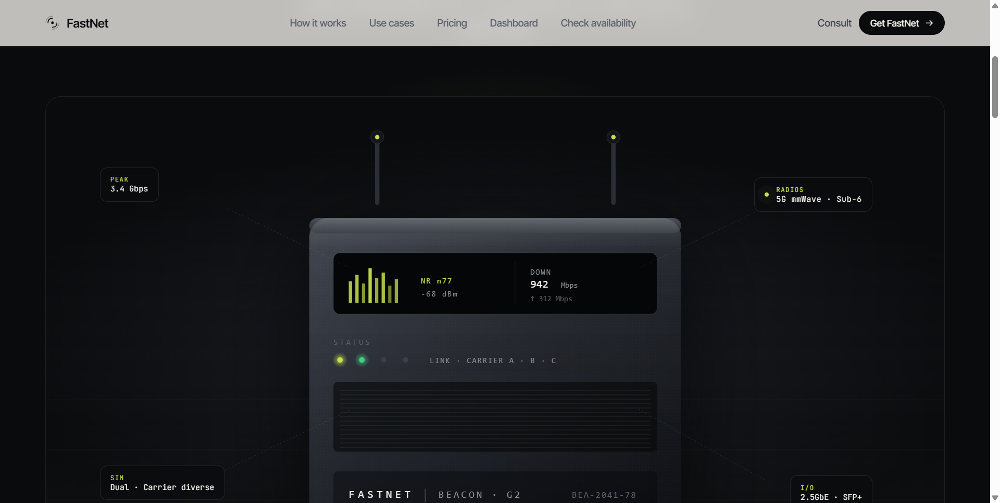
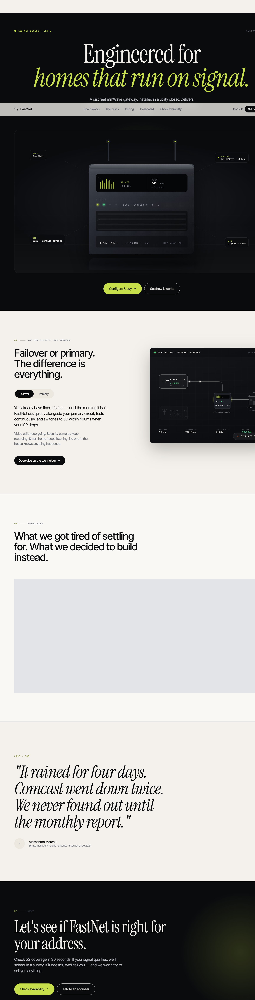
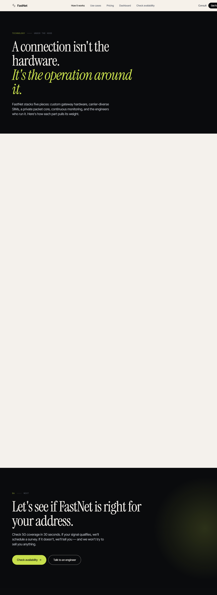
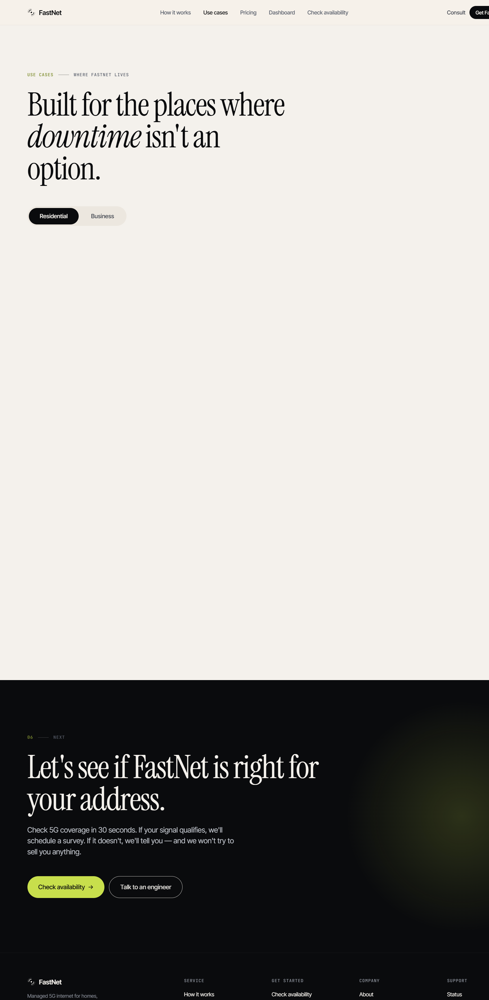
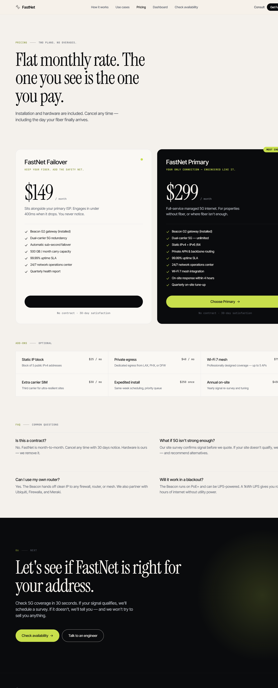
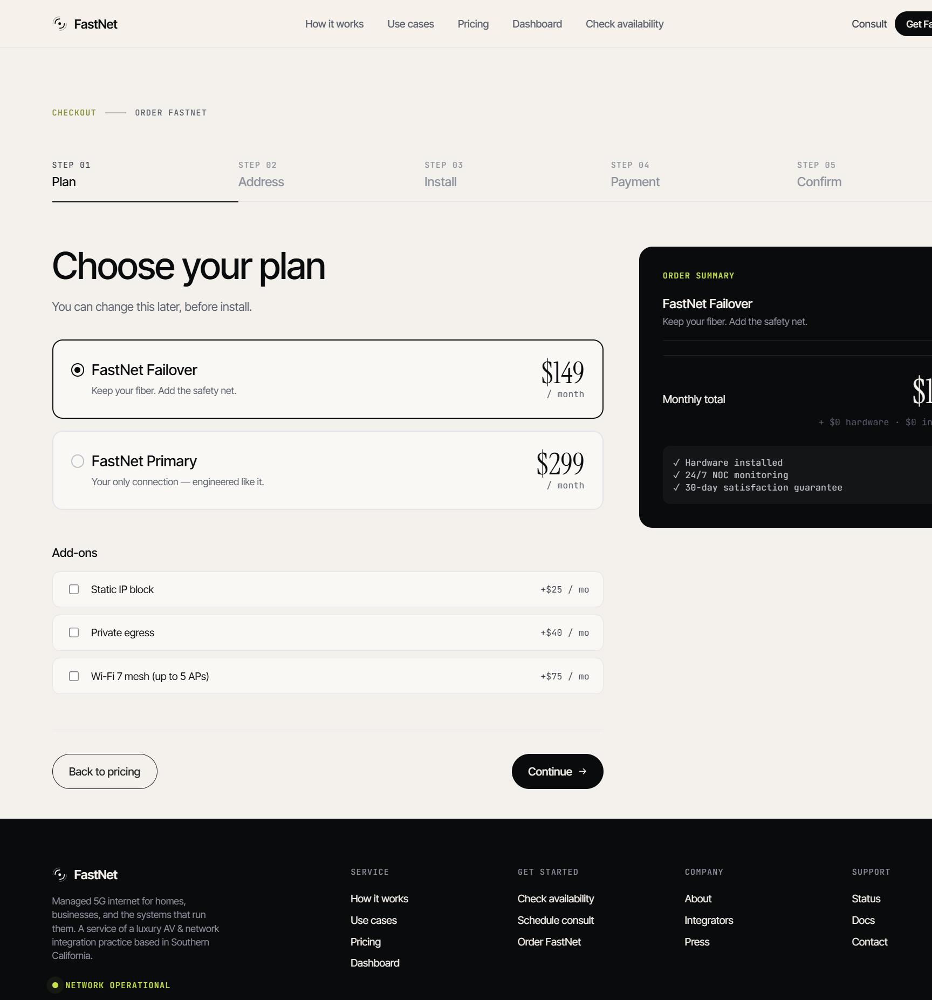
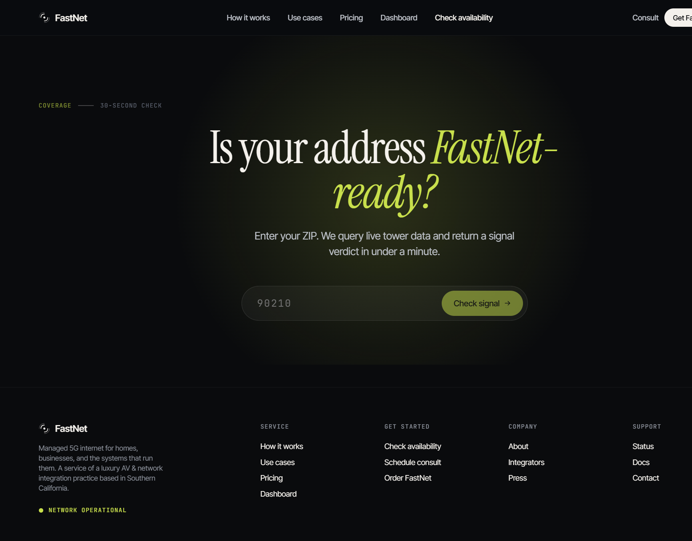
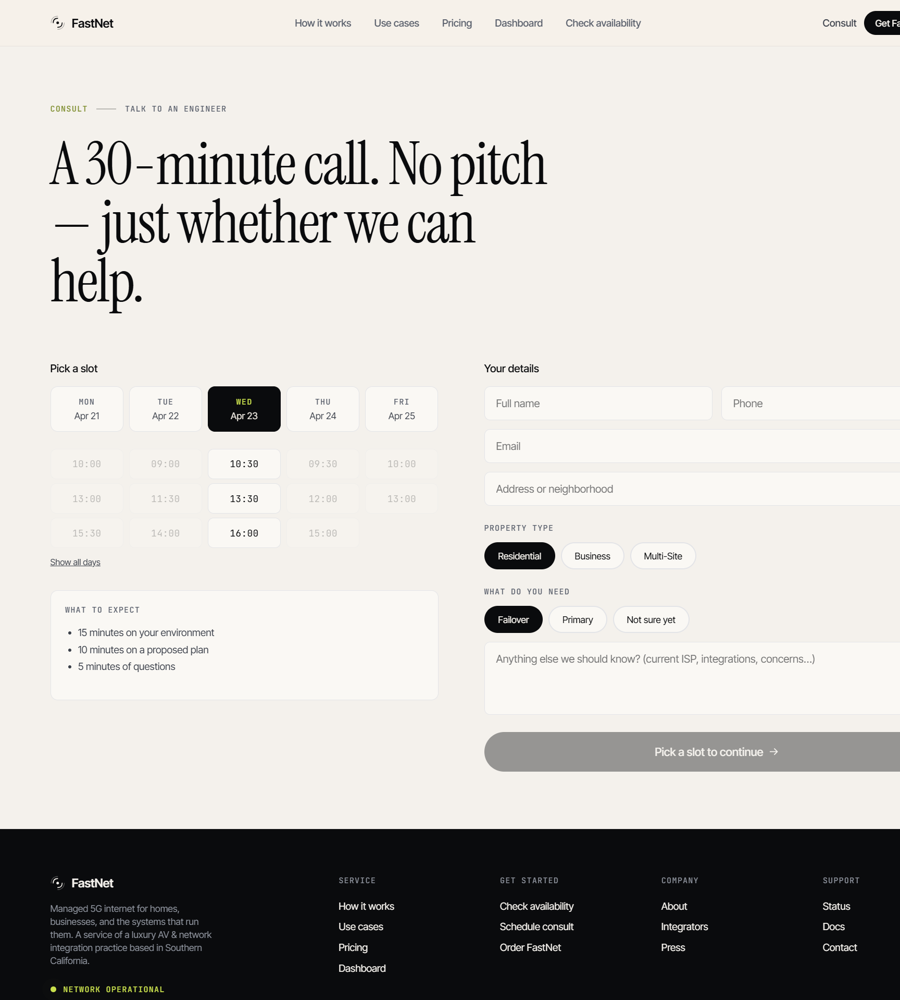
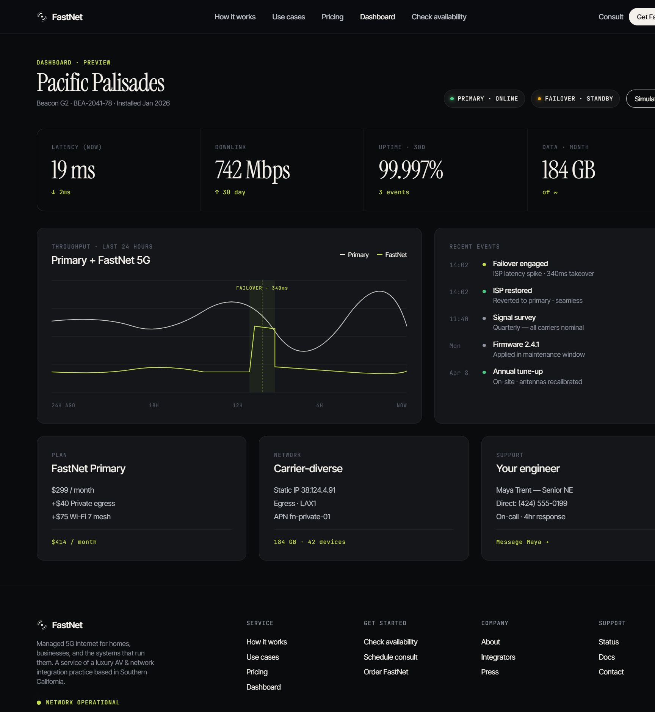

# FastNet

> Resilient 5G internet for homes, businesses, and the systems that run them.

A polished single-page landing site with eight navigable views: hardware-led product hero, technical deep-dive, residential vs. business use cases, pricing, a five-step checkout, ZIP-based availability lookup, consultation scheduler, and a live customer dashboard preview.

Built as a React 18 SPA, bundled and minified with esbuild, deployed as static assets on Vercel.

---

## Preview

### Home — Product hero

The default hero showcases the **Beacon G2** gateway with a live signal display, live throughput readout, and four spec callouts wired to the chassis with dashed leader lines.



Below the fold: an interactive failover diagram that auto-cycles between *ISP online / FastNet standby* and *ISP outage / FastNet active*, the principles grid, a pull-quote testimonial, and the final CTA.



### How it works

A five-step technical breakdown — site survey, gateway hardware, carrier-diverse routing, private packet core, and 24/7 monitoring — each with a spec table.



### Use cases

Residential / Business toggle. Each segment lists four typical deployments with measurable outcomes (download, switchover time, integrations, etc.).



### Pricing

Two flat-rate plans, an add-ons matrix, and an FAQ block.



### Checkout

Five-step flow — plan, address & coverage, install scheduling, payment, confirmation — with a sticky order-summary sidebar.



### Availability

Dark-themed ZIP entry with an animated radar backdrop. Submitting returns a coverage verdict and per-carrier signal strengths.



### Consultation

Day/time picker with a contact form. Click any day card to filter time slots; click a slot to enable the booking CTA.



### Dashboard preview

Customer-facing telemetry: live latency, 24-hour throughput chart with failover annotations, recent events, plan summary, network details, and assigned engineer.



---

## Features

- **Three hero variants** — *Editorial* (typographic), *Product* (Beacon G2 device shot, default), *Signal* (animated canvas with concentric pulse rings). Switch live from the Tweaks panel.
- **Interactive failover diagram** — auto-cycles network states with animated packet flow, status pills, and live metrics strip.
- **5-step checkout** — plan select with add-ons, address + coverage estimate, install scheduler, payment, confirmation. Sticky order-summary sidebar.
- **ZIP availability checker** — signed coverage verdict + per-carrier signal bars.
- **Live dashboard** — 24h throughput chart, event log, "Simulate outage" button that animates a real failover event into the chart.
- **Consultation scheduler** — clickable day cards, time-slot filtering, contact form with property type + need pickers.
- **Tweaks panel** — bottom-right toggle: hero variant · accent color (lime / amber / cyan / coral) · display type (serif / sans) · pricing layout.
- **Persistent route** — last-visited page restored from `localStorage`.
- **Dark theme** auto-applied to Availability and Dashboard.

---

## Design system

| Token | Value |
|------|------|
| Ink (canvas dark) | `#0A0B0D` |
| Bone (canvas light) | `#F4F1EC` |
| Signal accent | `oklch(0.86 0.17 118)` (lime; switchable) |
| Display | Instrument Serif |
| UI | Inter Tight |
| Mono | JetBrains Mono |

Editorial-luxury aesthetic: near-black canvas, warm bone whites, one signal accent that pulses on live elements.

---

## Stack

- **React 18** (UMD `.production.min.js` from CDN)
- **esbuild** for JSX transform + minification (no Webpack, no Vite, no babel-standalone)
- **Static output** — single `index.html` + ~100KB minified `bundle.js`
- **Vercel** for hosting; works on any static host (Netlify, S3+CloudFront, GH Pages, etc.)

No runtime framework dependencies. Build runs in under a second.

---

## Run locally

```bash
npm install
npm run dev
```

Opens on `http://localhost:5173`.

## Build

```bash
npm run build
```

Outputs `dist/` — `index.html` + `bundle.js`. Drop into any static host.

## Deploy to Vercel

Two options:

**Git integration** — push to GitHub, import the repo at [vercel.com/new](https://vercel.com/new). `vercel.json` is preconfigured (build command, output directory, immutable cache headers on `bundle.js`).

**CLI**

```bash
npm i -g vercel
vercel        # link + preview
vercel --prod # production deploy
```

---

## Project layout

```
src/
  app.jsx           root component + route state
  primitives.jsx    Logo, Arrow, Reveal, Ticker, StatusPill, SignalIcon, SectionTag
  nav.jsx           top nav
  hero.jsx          three hero variants (editorial / product / signal)
  sections.jsx      home page sections (failover explainer, principles, quote, CTA, footer)
  howitworks.jsx    /how
  usecases.jsx      /usecases  (residential / business toggle)
  pricing.jsx       /pricing   (cards + add-ons + FAQ)
  checkout.jsx      /checkout  (5-step flow)
  availability.jsx  /availability
  consultation.jsx  /consultation
  dashboard.jsx     /dashboard (live preview)
  tweaks.jsx        floating tweaks panel
build.mjs           esbuild transform + HTML rewrite
serve.mjs           tiny Node static server for local preview
vercel.json         Vercel build config + cache headers
FastNet.html        source HTML (build input — final output lands in dist/)
```

---

## Tweaks panel

Open the floating toggle bottom-right to swap, live:

- **Hero variant** — editorial · product · signal
- **Accent color** — lime · amber · cyan · coral
- **Display typeface** — serif (Instrument Serif) · sans (Inter Tight)
- **Pricing layout** — cards · table

To change the boot defaults, edit `TWEAK_DEFAULTS` in `src/app.jsx`.

---

## License

Private project — not licensed for external reuse.
