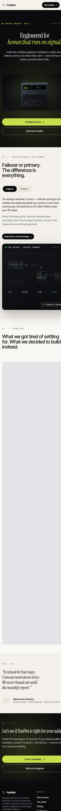

# FastNet

> Premium 5G internet landing site — showcase project by **Mahmoud Amr**.

**Live:** [fastnet-landing.vercel.app](https://fastnet-landing.vercel.app)
**Source:** [github.com/mahmoudamr512/fastnet-landing](https://github.com/mahmoudamr512/fastnet-landing)
**About me:** [fastnet-landing.vercel.app/about](https://fastnet-landing.vercel.app/about)

React 18 + TypeScript + Tailwind v4 single-page site with eight navigable views: hardware-led product hero, technical deep-dive, residential vs. business use cases, pricing, multi-step checkout, ZIP availability checker, calendar-based consultation scheduler, and a live customer dashboard preview. Bundled with esbuild, prerendered to static HTML for SEO, deployed to Vercel.

---

## Preview

### Home — Product hero


### Interactive failover diagram, pricing, mobile

| Dashboard | Pricing | Mobile |
| --- | --- | --- |
|  |  |  |

---

## Features

- **Three hero variants** — editorial / product / signal. Switch live from the Tweaks panel.
- **Interactive failover diagram** — auto-cycles ISP-online / outage states with animated packet flow + live metrics.
- **Five-step checkout** — plan + add-ons, address with coverage estimate, install scheduler, payment, confirmation. Sticky order-summary sidebar.
- **ZIP availability checker** — signed coverage verdict + per-carrier signal bars.
- **Live dashboard** — 24h throughput chart, event log, simulate-outage button that animates a real failover event into the chart.
- **Calendar consultation scheduler** — day picker filters time slots, contact form with property-type and need pickers.
- **Tweaks panel** — bottom-right toggle: hero variant · accent color (lime / amber / cyan / coral) · display type (serif / sans) · pricing layout.
- **Mobile-first** — hamburger menu, full-screen menu sheet, responsive grids, touch-friendly targets.
- **Real URLs** — `pushState` routing, per-route static HTML via prerender, per-route canonical + OG meta.

---

## Stack

| Area | Choice |
| --- | --- |
| UI | React 18 (TypeScript), bundled with esbuild |
| Styling | Tailwind CSS v4 with `@theme` design tokens |
| SEO | Puppeteer-driven prerender (static HTML per route) |
| Build | `scripts/build.mjs` — Tailwind → esbuild → HTML rewrite → prerender |
| Tests | Vitest + React Testing Library + jsdom |
| Lint / format | ESLint 9 (flat config) + Prettier |
| Hosting | Vercel (auto-deploy on push) |

No runtime framework. Final output: 1 `index.html` per route (9 total) + 1 bundled `bundle.js` + 1 `styles.css`. Everything else is static assets.

---

## Architecture

```
src/
  main.tsx        entry — mounts <App /> to #root
  app.tsx         route state, meta sync, theme toggle, hero variant dispatch
  primitives.tsx  Logo, Arrow, SignalIcon, SectionTag, Reveal, Ticker,
                  StatusPill, AuthorBadge, cn() helper, shared types
  nav.tsx         sticky header + mobile sheet menu
  hero.tsx        3 hero variants (Editorial / Product / Signal)
  sections.tsx    FailoverExplainer, FailoverDiagram, Principles, PullQuote,
                  FinalCTA, Footer
  howitworks.tsx  /how-it-works page
  usecases.tsx    /use-cases page  (residential / business toggle)
  pricing.tsx     /pricing page    (cards + add-ons + FAQ)
  checkout.tsx    /checkout page   (5-step flow, extracted sub-components)
  availability.tsx   /availability page
  consultation.tsx   /consultation page
  dashboard.tsx      /dashboard preview page
  about.tsx          /about Mahmoud Amr page
  tweaks.tsx         floating Tweaks panel
  input.css          Tailwind @theme tokens + component classes

scripts/
  build.mjs       Tailwind + esbuild + HTML rewrite + prerender orchestrator
  prerender.mjs   Headless Chrome snapshot of each route → dist/<route>/index.html
  serve.mjs       Local static preview

tests/
  primitives.test.tsx   smoke tests for shared primitives
  setup.ts              jest-dom matchers

public/               Static assets (favicon, og.png, mahmoud.jpg, sitemap.xml,
                      robots.txt, Google Search Console verification)
FastNet.html          HTML entry template (transformed by build)
tsconfig.json         Strict TS config
eslint.config.js      ESLint 9 flat config
.prettierrc.json      Prettier config
vitest.config.ts      Vitest + jsdom setup
vercel.json           Hosting config + cache headers + rewrites
```

### Design system

Tokens defined once in `src/input.css` via Tailwind v4 `@theme`:

| Token | Value |
| --- | --- |
| Ink (canvas dark) | `#0A0B0D` |
| Bone (canvas light) | `#F4F1EC` |
| Signal accent | `oklch(0.86 0.17 118)` (lime; accent switches via Tweaks panel) |
| Display | Instrument Serif |
| UI | Inter Tight |
| Mono | JetBrains Mono |

---

## Develop

```bash
nvm use          # reads .nvmrc — Node 20
npm install
npm run dev      # build once then serve dist/ on :5173
```

Scripts:

```bash
npm run build        # Tailwind + esbuild + prerender → dist/
npm run preview      # Serve prebuilt dist/
npm run typecheck    # tsc --noEmit
npm run lint         # ESLint
npm run format       # Prettier write
npm test             # Vitest
```

## Deploy

Push to `main` — Vercel runs `npm run build` and ships `dist/`. `vercel.json` preconfigures rewrites, cache headers, and security headers.

---

## About the author

**Mahmoud Amr** — senior software engineer · full-stack, AI & automation · based in Cairo · freelancing since 2016.

Available for contract work:
- [Upwork](https://www.upwork.com/freelancers/mahmouda299)
- [LinkedIn](https://www.linkedin.com/in/mahmoud-a-46818913b/)
- [GitHub](https://github.com/mahmoudamr512)
- [contact@mahmoudamr.dev](mailto:contact@mahmoudamr.dev)

## License

[MIT](./LICENSE)
